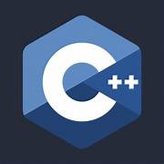

# Hi there, I'm Faizan 👋 

## I'm a Master's Student in Robotics and AI Developer

- 🌱 I’m currently learning MLOps
- 👯 I’m looking to collaborate with other developers on AI projects
- 🌱 Over 2 years of experience working as a Machine learning and computer vision developer
- 🥅 2023 Goals: Learn more about LLMs, use it to build solutions for the local bussiness problems

### Connect with me:

  

  

### Languages and Tools:

    
    
    
    
    
    
    
    
    
    

## __

### My Github Stats

    

### GitHub Languages

    

### Blog Posts
1. [How to start your AI career](https://medium.com/@engr_faizan_ml/how-to-start-your-ai-career-e0d12dc7cc4f)
2. [Machine Learning Strategies Part 01: Machine Learning](https://medium.com/@engr_faizan_ml/machine-learning-strategies-286d74a0d0bd)
3. [Machine Learning Strategies Part 02: Dataset](https://medium.com/@engr_faizan_ml/machine-learning-strategies-part-2-959eb876b141)
4. [Machine Learning Strategies Part 03: A single number evaluation metric](https://medium.com/@engr_faizan_ml/machine-learning-strategies-part-3-a-single-number-evaluation-metric-dac45ff55c45)
5. [Machine Learning Strategies Part 04: Basic error analysis](https://medium.com/mlearning-ai/machine-learning-strategies-part-04-basic-error-analysis-7a38cf0154b1)
6. [Machine Learning Strategies Part 05: Bias and Variance](https://medium.com/@engr_faizan_ml/machine-learning-strategies-part-05-bias-and-variance-621e9d21811)
7. [Machine Learning Strategies Part 06: Comparing to the optimal error rate](https://medium.com/@engr_faizan_ml/machine-learning-strategies-part-06-comparing-to-the-optimal-error-rate-3685baa4e029)
8. [Machine Learning Strategies Part 07: Addressing Bias and Variance](https://medium.com/@engr_faizan_ml/machine-learning-strategies-part-07-addressing-bias-and-variance-b1974e525d38)
9. [Machine Learning Strategies Part 08: Learning Curve](https://medium.com/@engr_faizan_ml/machine-learning-strategies-part-08-learning-curve-832312f7c198)

### Certifications
1. [AI for everyone](https://www.coursera.org/account/accomplishments/certificate/42YTKKCRKFD6)
2. [Mathematics for machine learning: multivariate calculus](https://www.coursera.org/account/accomplishments/certificate/F89VBDTLRUNY)
3. [Mathematics for machine learning: linear algebra](https://www.coursera.org/account/accomplishments/certificate/FJDM4WEDKAMS)
4. [MATLAB Onramp](https://matlabacademy.mathworks.com/progress/share/certificate.html?id=051755cf-4149-4122-a948-688abf2012f4&)
5. [Machine Learning](https://www.coursera.org/account/accomplishments/certificate/J9JGV57EN7JZ)
6. [Deep Learning Specialization](https://www.coursera.org/account/accomplishments/specialization/certificate/KBM9GR7WU5UJ)
7. [TensorFlow in Practice Specialization](https://www.coursera.org/account/accomplishments/specialization/certificate/TNR7XP37MY6V)
8. [Custom models, layers, and loss functions with TensorFlow](https://www.coursera.org/account/accomplishments/certificate/H4ZG24SLMPH8)
9. [Custom and distributed training with TensorFlow](https://www.coursera.org/account/accomplishments/certificate/6EET8W6FEBE6)
10. [AI for medical diagnosis](https://www.coursera.org/account/accomplishments/certificate/42YTKKCRKFD6)
11. [Writing: grammar and punctuation](https://www.coursera.org/account/accomplishments/certificate/ZBU8KHPZZ5HW)