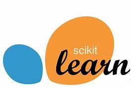

# Hi there, I'm Faizan 👋 

## I'm a Master's Student in Robotics and AI Developer

- 🌱 I’m currently learning MLOps
- 👯 I’m looking to collaborate with other developers on AI projects
- 🌱 Over 2 years of experience working as a Machine learning and computer vision developer
- 🥅 2023 Goals: Learn more about LLMs, use it to build solutions for the local bussiness problems

### Connect with me:

  

  

### Languages and Tools:

]

<!-- (https://github.com/anuraghazra/github-readme-stats)

 -->
<!--  -->
